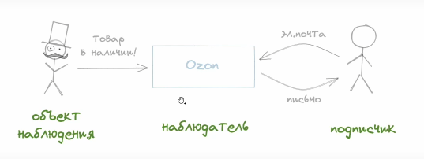

# 7.2 Паттерн наблюдатель

- этот способ уже придуман - есть отдельный паттерн, который позволяет решать эту проблему

- это достаточно простой паттерн, потому что с ним мы сталкивались в жизни

- допустим, мы собираемся купить книгу в интернет-магазине, находим в поиске и узнаём, что её нет в продаже, есть только цифровая версия

- как вариант можно оставить эту страницу браузера открытой и периодически её обновлять

- чтобы так не делать, во многих сервисах есть функция "узнать о поступлении"

- можно указать контакт для связи, и уведомить о поступлении товара

- это частный случай идеи паттерна "наблюдатель"

- то есть мы подписываемся на какую-то важную информацию и ждём

- сам магазин в этом случае является наблюдателем, и, когда продавец добавит нужный товар, сам магазин сможет уведомить о поступлении

- когда мы подписываемся на событие нажатия кнопки методом `addEventListener`, мы становимся подписчиком, и как только это событие произойдёт нам об этом сообщат - будет вызван коллбэк

- паттерн наблюдатель хорошо описан, можно почитать по ссылке 
https://sourcemaking.com/design_patterns/observer