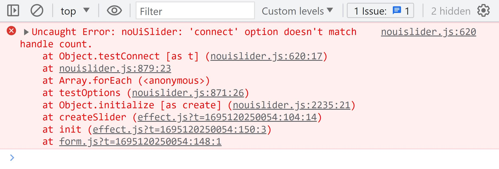

# Ошибки в JavaScript

- ошибки - это неисправности, устранить которые средствами самого языка невозможно
- одна из самых частых ошибок - синтаксическая, например, опечатка, JS не знает, как интерпретировать конструкцию
- столкнувшись с ошибкой, движок JS прекращает разбор кода, в консоль будет выведено сообщение об ошибке

## Виды ошибок

- SyntaxError - синтаксическая ошибка, возникает, когда движок встречает незнакомую конструкцию, обычно выявляется на этапе разбора кода

```js
		const cat = {
			#name: 'Keks'
		};
		// Uncaught SyntaxError: Unexpected identified '#name'
```

- ReferenceError - ошибка обращения, возникает, когда мы обращаемся к несуществующей переменной или параметру

```js
const cat = 'Keks';
console.log(cot);
// Uncaught ReferenceError: cot is not defined
```

- TypeError - ошибка типа, возникает, когда мы пытаемся совершить операцию, несовместимую с этим типом данных

```js
const cat = 'Keks';
cat();
// Uncaught TypeError: cat is not a function
```

- RangeError - ошибка диапазона, возникает, когда переданное значение находится за пределами допустимого диапазона, например, массив отрицательной длины

```js
Array(-2);
// Uncaught RangeError: Invalid array length
```

# Исключения

- исключительные ситуации - это некритичные сбои, которые не должны приводить к полной поломке сайта
- чаще всего исключения возникают при работе с внешними ресурсами: сервером, сторонними библиотеками и пользователями
- допустим, есть поле загрузки файла, и программа ожидает, что загруженный файл будет определённого типа, не больше обговорённого размера, без внутренних ошибок
- однако, если пользователь загружает то, с чем не умеет работать сайт, правильнее будет показать пользователю информационное сообщение, очистить поле ввода и предложить загрузить другой файл
- другой пример - работа с сервером: если во время загрузки данных произошёл сбой, и полученный JSON прочитать не получается, сайт не должен ломаться, в этом случае стоит попытаться загрузить данные ещё раз

## Блоки try, catch, finally

- обработать исключения можно с помощью конструкции try/catch

1. код, который потенциально может привести к исключению, оборачивается в блок try
2. после него добавляется блок catch, код в котором будет выполнен, если произойдёт исключение

- например, мы загружаем данные с сервера с помощью функции getData(), затем пытаемся распарсить полученный JSON и вывести его содержимое в консоль:

```js
import getData from 'api.js';

const dataFromServer = getData();
const parsedData = JSON.parse(dataFromServer);
console.log(parsedData);

// Остальной код программы...
console.log('Если не получится загрузить или разобрать JSON, я не выполнюсь');
```

- теперь используем блоки `try/catch`
- если файл загрузился и его удалось распарсить, напишем об успехе в консоль

```js
import getData from 'api.js';

try {
  const dataFromServer = getData(); // (1)
  const parsedData = JSON.parse(dataFromServer); // (2)
  console.log(parsedData); // (3)
  console.log('Удалось загрузить и прочесть загруженный JSON!'); // (4)
} catch (err) {
  console.log('Что-то пошло не так...'); // (5)
}

// Остальной код программы...
console.log('Я выполнюсь в любом случае'); // (6)
```

- если файл вообще не получится загрузить (строка (1)), то выполнение кода в блоке try остановится, и JavaScript сразу перейдёт к выполнению строки (5) внутри блока catch, а после к строке (6)
- если файл загрузился, но его не удалось распарсить, то отработают строки (1), (2), (5) и (6)
- если же с разбором JSON проблем не возникло, то выполнятся строки c (1) по (4), а также (6). Код внутри catch будет проигнорирован

- однако в любом случае программа не сломается и не прекратит выполнение

- в параметр err в блоке catch попадает информация о произошедшем сбое / (Если возникает исключительная ситуация, то в первый параметр блока catch попадет объект со случившейся ошибкой. Свойство name этого объекта содержит имя ошибки (фактически ее тип), а свойство message - текст этой ошибки)

- помимо блоков try и catch есть ещё блок finally, код в нём будет выполнен и в случае успеха и в случае ошибки:

```js
import getData from 'api.js';

try {
  const dataFromServer = getData();
  const parsedData = JSON.parse(dataFromServer);
  console.log(parsedData);
  console.log('Удалось загрузить и прочесть загруженный JSON!');
} catch (err) {
  console.log('Если всё хорошо, я никогда не выполнюсь');
} finally {
  console.log('Я выполнюсь в любом случае');
}
```

- блок `finally` необязательный, но если он использован, то можно обойтись без `catch`:

```js
import getData from 'api.js';

try {
  const dataFromServer = getData();
  const parsedData = JSON.parse(dataFromServer);
  console.log(parsedData);
  console.log('Удалось загрузить и прочесть загруженный JSON!'); // (1)
} finally {
  console.log('Я выполнюсь в любом случае'); // (2)
}
```

- если всё пройдёт удачно, то в консоль выведутся данные и оба сообщения, а если при загрузке или разборе произойдёт ошибка, то только сообщение (2)
- использовать один только блок try (без catch или finally) нельзя

## Объект Error

- вывод в консоль объекта Error:

```js
try {
  catchme;
} catch (err) {
  console.log(err);
}
//ReferenceError: catchme is not defined
```

- очень похоже на текст ошибки, который мы получали ранее, только теперь программа не прекращает выполнение
- таким образом, можно обработать как исключение и некоторые ошибки, правда, не все, а только те, что произошли на этапе выполнения кода (то есть большинство синтаксических ошибок «поймать» не получится)

- содержит следующие свойства:
  - name — имя ошибки, как правило, соответствует её типу, то есть `SyntaxError`, `TypeError` и так далее
  - message — описание ошибки, например, `undefined is not a function`
  - stack — нестандартизированное свойство, которое тем не менее есть во многих современных браузерах, в нём содержится стек вызовов, который привёл к ошибке
- информацию, содержащуюся в объекте ошибки, можно использовать, чтобы показать пользователю более осмысленное сообщение, для логирования или для того, чтобы изменять поведение в зависимости от типа ошибки

- если ошибка произошла на этапе загрузки, можно попытаться связаться с сервером ещё раз, а если проблема в невалидном JSON, то так и напишем в консоль:

```js
import getData from 'api.js';

function printData(rawData) {
  const parsedData = JSON.parse(rawData);
  console.log(parsedData);
}

try {
  printData(getData());
} catch (err) {
  if (err.name === 'SyntaxError') {
    // Если не удалось разобрать JSON, получим синтаксическую ошибку
    console.log('Сервер прислал невалидный JSON');
  } else {
    printData(getData()); // Пробуем загрузить и прочесть данные ещё раз
  }
}
```

## Выбрасывание исключений

- предположим, что файл загрузился, распарсился, но содержит не ту информацию, на которую рассчитывала наша программа, допустим, мы ожидаем получить описание кота:

```json
{
  "name": "Кекс"
}
```

- а вместо этого пришло что-то совершенное иное:

```json
{
  "favoriteFood": "Шпинат"
}
```

- с точки зрения JavaScript, всё правильно, но не с точки зрения нашей программы, можно подстраховаться и проверить пришедшие данные с помощью условия:

```js
import getData from 'api.js';

try {
  const parsedData = JSON.parse(getData());

  if (!parsedData.name) {
    console.log('Не удалось найти свойство name');
  } else {
    console.log(parsedData);
  }
} catch (err) {
  console.log('Что-то пошло не так');
}
```

- однако обрабатывать все внештатные ситуации удобно в одном месте — например, в одном блоке catch, для этого выбрасывают собственное исключение
- делается это с помощью оператора throw, которому передаётся новый объект ошибки:

```js
throw new Error('Описание ошибки');
```

- в этом случае в свойство name объекта ошибки запишется Error, текст 'Описание ошибки' попадёт в свойство message, а свойство stack браузер заполнит автоматически в зависимости от того, где мы выбросили исключение

- используем этот подход в примере с загрузкой и чтением JSON-файла:

```js
import getData from 'api.js';

try {
  const parsedData = JSON.parse(getData());

  if (!parsedData.name) {
    throw new Error('Не удалось найти свойство name');
  } else {
    console.log(parsedData);
  }
} catch (err) {
  console.log(err.message);
}
```

- теперь мы провалимся в блок `catch` и если не отвечает сервер, и если не удалось прочитать JSON, и если в прочитанном файле не оказалось ожидаемых данных
- во всех случаях программа продолжит работать, а в консоль выведется сообщение об ошибке — в каждом из случаев своё
- этот приём используется в программировании достаточно часто, особенно при разработке библиотек, когда нужно проверить, что программист, использующий библиотеку, всё делает правильно и соблюдает контракты, описанные в документации; если же контракт нарушен, то нужно «выбросить» понятную ошибку и подсказать, как её исправить
- вот пример подобной ситуации: если мы не передадим noUiSlider правильные аргументы, то получим ошибку, причём не от JavaScript, а от авторов библиотеки !



##

- существует и другой подход к обработке ошибок — Error Boundary («граница ошибки», англ.)
- смысл его в том, чтобы разделить сайт на независимые части таким образом, чтобы сбой в одной части никак не сказывался на работоспособности остальных
- допустим, пользователь вашего сайта может загружать собственные фотографии (первая часть) и просматривать фотографии других пользователей (вторая часть)
- эти функциональности никак друг от друга не зависят, а значит, если сломался механизм отправки фотографии, то на компоненты сайта, отвечающие за просмотр изображений от других пользователей, это влиять не должно, и наоборот, если не удаётся получить фотографии других пользователей, это не должно мешать отправке нового изображения
- при этом «сломанная» часть сайта может показывать ошибку и обещать вскоре починиться, в то время как другие продолжат свою работу

- часто все эти подходы применяются одновременно, части приложения разделяются, если это возможно, и ошибки в каждой из них обрабатываются независимо
- однако если произошло что-то глобальное, то в дело вступает общий обработчик исключений, а если и он не справился, остаётся только залогировать и упасть
