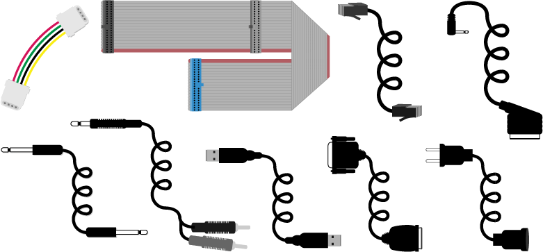
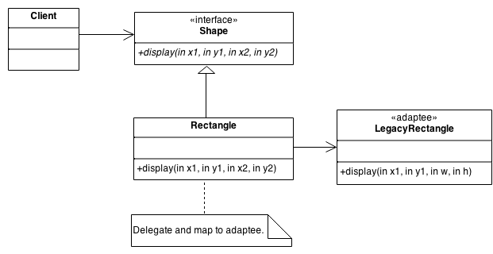
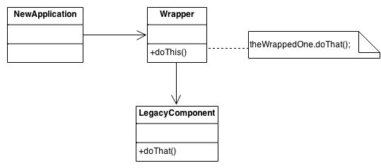
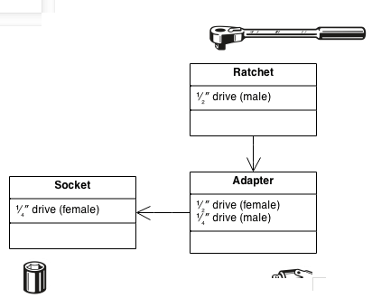

# 8.4 Шаблон проектирования "Адаптер"

## Назначение

- Адаптер преобразует интерфейс класса в другой интерфейс, ожидаемый клиентом
- Это позволяет классам, у которых несовместимые интерфейсы, работать вместе
- Адаптер оборачивает существующий класс новым интерфейсом
- Он согласовывает несовместимый компонент с новой системой

## Проблема

- Компонент, который вы хотите использовать повторно, может обладать нужной функциональностью, но его структура и архитектура несовместимы с текущей системой

## Обсуждение

- Повторное использование старого кода часто вызывает сложности
- Основная проблема заключается в том, что всегда есть что-то, что не совсем соответствует ожиданиям между старым и новым кодом
- Это может касаться физических параметров, синхронизации, или разных предположений о работе системы

- Такую ситуацию можно сравнить с попыткой подключить новую трёхконтактную вилку в старую двухконтактную розетку — требуется адаптер или посредник

- Адаптер создаёт промежуточную абстракцию, которая переводит или отображает старый компонент на новую систему
- Клиенты обращаются к методам объекта Адаптера, которые перенаправляют запросы к устаревшему компоненту
- Этот подход можно реализовать либо через наследование, либо через композицию.

- Адаптер функционирует как обёртка или модификатор существующего класса
- Он предоставляет другой или преобразованный интерфейс для взаимодействия с этим классом

## Структура

- Предположим, что метод `display()` у старого компонента "Прямоугольник" ожидает параметры "x, y, w, h"
- Однако клиент хочет передавать координаты "верхний левый x и y" и "нижний правый x и y"
- Эту проблему можно решить с помощью объекта Адаптера, который добавит необходимую косвенность

- Адаптер можно также рассматривать как "обёртку", которая преобразует один интерфейс в другой

## Пример

- Шаблон "Адаптер" позволяет совместить несовместимые классы, преобразуя интерфейс одного класса в интерфейс, ожидаемый клиентами
- Примером адаптера может служить гаечный ключ с головкой
- Головка присоединяется к трещотке при условии, что размеры привода совпадают
- В США типичные размеры привода — 1/2" и 1/4"
- Очевидно, что трещотка на 1/2" не подойдёт к головке на 1/4", если не использовать адаптер
- Адаптер с 1/2" на 1/4" имеет гнездо для привода на 1/2" и шток на 1/4".

## Чек-лист

1. Определите участников: компоненты, которые нужно адаптировать (клиент), и компоненты, которые нужно приспособить (адаптируемый объект)
2. Определите интерфейс, который требуется клиенту
3. Спроектируйте класс-обёртку, который сможет согласовать адаптируемый компонент с клиентом
4. Класс адаптера/обёртки содержит экземпляр адаптируемого класса
5. Класс адаптера/обёртки отображает интерфейс клиента на интерфейс адаптируемого объекта
6. Клиент использует новый интерфейс, предоставленный адаптером

## Правила

- Адаптер решает проблему несовместимости после разработки; Мост устраняет её на этапе проектирования
- Мост проектируется заранее для того, чтобы абстракция и реализация могли изменяться независимо. Адаптер применяется для объединения несовместимых классов после разработки
- Адаптер предоставляет другой интерфейс своему объекту. Прокси предоставляет тот же интерфейс. Декоратор предоставляет расширенный интерфейс
- Адаптер предназначен для изменения интерфейса существующего объекта. Декоратор улучшает объект, не изменяя его интерфейс. Таким образом, Декоратор более прозрачен для приложения по сравнению с Адаптером. Декоратор поддерживает рекурсивное объединение, что невозможно с чистыми Адаптерами
- Фасад определяет новый интерфейс, тогда как Адаптер переиспользует старый интерфейс. Помните, что Адаптер объединяет два существующих интерфейса, а не создаёт новый
