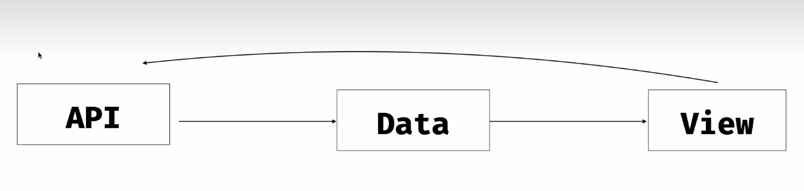

# Архитектура приложения

- данные приходят с сервера (API)
- когда пользователь будет взаимодействовать с представлением (компонентами), они могут делать какие-то реакции и связываться с сервером, чтобы он вернул данные для нужного события

- например, мы заходим на главную страницу приложения, значит, мы должны получить список предложений аренды в данном городе, который выбран
- или когда пользователь меняет фильтры в "Шести городах", мы должны запросить объявления для определённого города

- когда пропсы компонента обновляются, компонент автоматически перерисовывается

## Состояние приложения

- когда мы взаимодействуем с приложением, мы меняем его состояние

- состояние приложения устойчиво ... до тех пор, пока над объектом не будет произведено действие пользователем, после этого состояние может измениться

- поэтому нам нужно научиться восстанавливать состояние

- когда мы кликаем на что-то, что-то вводим, меняем фильтрацию или сортировку, меняется состояние приложения, и должен меняться вид приложения

- нам, как пользователям, хочется всегда возвращаться к определённому состоянию приложения (например восстановление всех открытых вкладок браузера)

- в веб-приложении может потребоваться сохранить состояние с целью восстановления определённого результата (фильтры при выборе отеля, вернуться к странице поиска с определёнными отелями)

### могут изменяться

  - фильтры: даты заезда/выезда, количество гостей и комнат, ...
  - сортировка: по цене, по звёздам, ...
  - номер страницы
  - режим отображения

- восстанавливать состояние вручную никому не хочется
- и, мы захотим передать результаты поиска другому человеку, то нам нужно передать состояние

- единственным и правильным решением является то, что было изобретено изначально - адресная строка