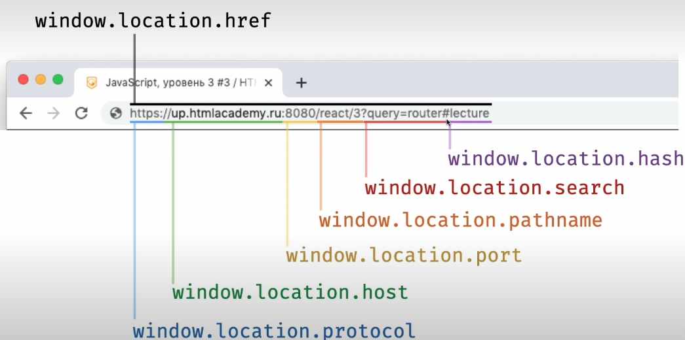

# Адресная строка

- она позволяет веб-приложениям восстанавливать своё состояние
- она может и восстановить, и хранить текущее
- помогает воспроизвести произвольное состояние
- является дополнительным инструментом взаимодействия

- с помощью адресной строки можно манипулировать состоянием приложения

- например путь к сайту курса

up.htmlacademy.ru/react/3

- 3 - это адрес третьего потока курса по react, и когда мы переходим по этому адресу, приложение восстанавливает состояние

## как можно работать с адресной строкой из JS

- для этого браузер предоставляет интерфейс Location API, с помощью которого можно взаимодействовать с адресной строкой

- в объекте window есть объект location, через который можно общаться с адресной строкой

- свойства объекта location:

  - `href` содержит весь путь, который указан в адресной строке
  - `protocol` содержит только информацию об использованном протоколе (http, https)
  - `host` содержит имя хоста (на картинке это up.htmlacademy.ru)
  - `port` - содержит информацию о порте, на котором запущено приложение
  - `pathname` - путь к определённому ресурсу
  - `search` - параметры (значение, которое идёт после знака `?`, и оно в формате ключ-значение (query=router))
  - `hash` - якоря для использования при навигации внутри страницы

- страницы будут генерироваться динамически по действию пользователя
- то есть будет только один файл index.html, а сами страницы приложения являются компонентами

- нам нужен какой-то механизм для обработки запросов к компонентам-страницам

### History API

- позволяем эмулировать перемещение по страницам приложения
- для этого браузер предоставляет объект history с рядом методов

- `back()` - перемещение назад
- `forward()` - перемещение вперёд
- `go(num)` - для перемещения на num шагов назад
- `pushState(state, title, url)` - для перехода в другое состояние
