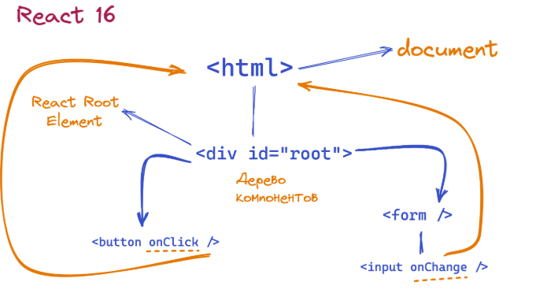
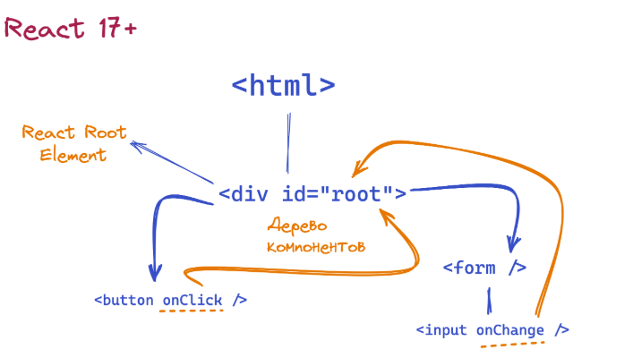

# События в React

- При работе с событиями в React важно учитывать несколько ключевых отличий от обработки событий в обычных DOM-элементах
- В React события обрабатываются с помощью пропсов, а не через методы, такие как addEventListener

- В обычном JavaScript для подписки на события часто используется метод `addEventListener`
- Сначала находим элемент, а затем подписываемся на событие:

```javascript
// Поиск DOM-элемента
const buttonElement = document.querySelector('button');

// Подписка на событие 'click'
buttonElement.addEventListener('click', () => {
  alert('Hello world');
});
```

- Альтернативный способ подписки — это использование атрибутов событий в HTML
- При объявлении тега можно сразу задать обработчик:

```html
html
<!DOCTYPE html>
<html>
  <head>
    <meta charset="utf-8" />
    <title>React. События</title>
  </head>
  <body>
    <div id="root">
      <button onclick="showMessage()">Нажми на меня</button>
    </div>

    <script>
      function showMessage() {
        alert('Hello world');
      }
    </script>
  </body>
</html>
```

- В React для подписки на события используется аналогичный подход, но через пропсы, передаваемые в компоненты
- Например, для события `click` используется пропс `onClick`:

```tsx
const containerElement = document.getElementById('root');

function App() {
  const handleClick = () => {
    alert('Hello world');
  };

  return <button onClick={handleClick}>Нажми на меня</button>;
}

const root = ReactDOM.createRoot(containerElement);
root.render(<App />);
```

- В React имена пропсов событий используют стиль `camelCase`, что отличается от стандартного синтаксиса в `HTML`
- Например, атрибут `onclick` в `HTML` превращается в `onClick` в React

- Существуют и другие события, такие как `onMouseOver`, для которых используется аналогичная схема:

```tsx
function App() {
  const handleMouseOver = () => {
    console.log('Mouse detected!');
  };

  return (
    <button onMouseOver={handleMouseOver} onClick={handleClick}>
      Нажми на меня
    </button>
  );
}
```

- Вместо создания функции обработчика отдельно, её можно задать прямо при определении пропса:

```jsx
const containerElement = document.getElementById('root');

function App() {
  return;
  <button onClick={() => alert('Hello world')}>Нажми на меня</button>;
}

const root = ReactDOM.createRoot(containerElement);
root.render(<App />);
```

- Однако стоит помнить, что если обработчик содержит несколько строк кода, лучше определить его в отдельной функции для улучшения читабельности
- Также создание функции обработчика каждый раз при перерисовке компонента может повлиять на производительность

- Для работы с объектом события в React используется параметр (например, `evt`), который передаётся в функцию обработчика
- Объект события в React отличается от нативного события, так как React использует `SyntheticEvent` — обёртку, которая унифицирует поведение событий в разных браузерах:

```jsx
function App() {
  return <button onClick={(evt) => console.log(evt)}>Нажми на меня</button>;
}
```

- React также позволяет обратиться к нативному объекту события через свойство `nativeEvent`:

```jsx
function App() {
  return (
    <form
      onSubmit={(evt) => {
        evt.preventDefault();
        console.log(evt.nativeEvent);
      }}
    >
      <button type='submit'>Нажми на меня</button>
    </form>
  );
}
```

- Для обработки событий на разных стадиях всплытия или перехвата в React используется постфикс `Capture` в пропсах
- Например, для события `click` используется `onClickCapture`:

```jsx
function App() {
  return (
    <button
      onClickCapture={() => {
        console.log('Hello world!');
      }}
    >
      Нажми на меня
    </button>
  );
}
```

- Начиная с React 17, события обрабатываются через делегирование, но вместо глобального document используется контейнер, в котором отрисовывается приложение
- Это позволяет улучшить производительность и использовать несколько React-приложений на одной странице.




