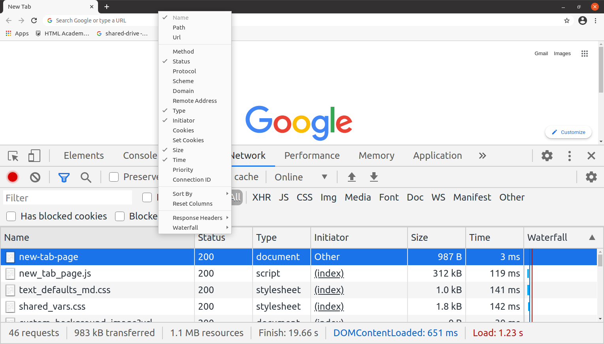
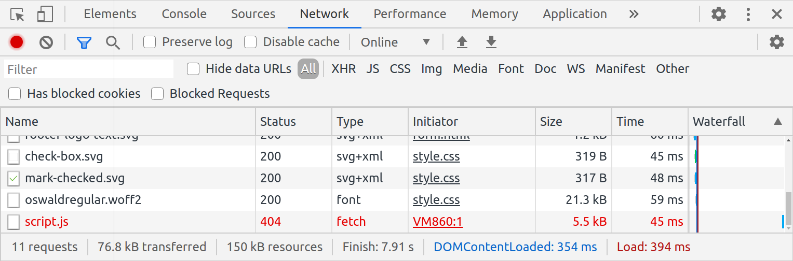
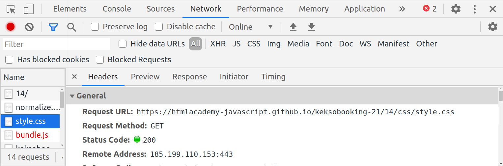
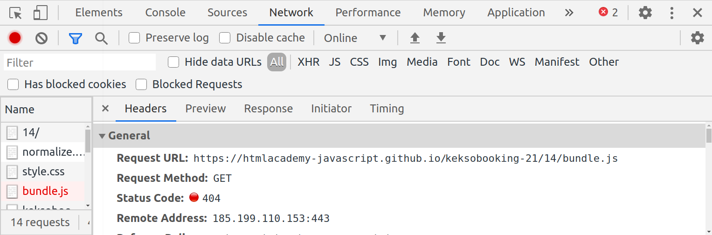

# Обзор вкладки Network #
## Обзор столбцов таблицы ресурсов ##
* С помощью вкладки Network можно выяснить, сколько времени заняла загрузка страницы, какие ресурсы подключились или не подключились к странице и многое другое. При первом открытии вкладка может оказаться пустой, потому что при закрытых инструментах веб-разработчика запись не ведётся, в этом случае просто перезагрузите страницу.

* После перезагрузки внизу появится таблица всех ресурсов, подключённых к странице, и данные о них:

	- Name — имя ресурса;
	- Status — статус ответа сервера (200, 404, 500 и другие);
	- Type — тип ресурса (script, stylesheet, font и другие);
	- Initiator — действие или скрипт, которые инициировали загрузку ресурса; при клике на название скрипта скрипт откроется во вкладке Sources;
	- Size — размер ресурса; браузер может кэшировать ресурсы, в таких случаях в этом столбце может быть значение memory cache (временный кэш, хранится до закрытия браузера) или disk cache (постоянный кэш, хранится, пока пользователь не очистит его);
	- Time — время загрузки ресурса в миллисекундах;
	- Waterfall — графическое представление времени загрузки с разделением на этапы; при наведении курсора на полосу появляется окно с подробной информацией.

* Кликнув по таблице правой кнопкой мыши, можно увидеть все доступные столбцы таблицы и выбрать нужные.

Рисунок 1. Выбор показанных столбцов ресурсов

* Обычно вкладку Network используют, чтобы узнать состояние ресурса, который не отображается на странице, но был к ней подключён. Смотрим в таблицу — если есть какая-то ошибка, ресурс будет выделен красным. Если ошибок нет, то статус каждого запроса — 200. Это значит, что ресурс загружен успешно.

Рисунок 2. Состояния ресурсов

Рисунок 3. Успешно загруженный ресурс

Рисунок 4. Ресурс с ошибкой запроса

Кстати, сообщение об ошибке загрузки ресурса отобразится и во вкладке Console.

Рисунок 5. Ошибка загрузки ресурса на вкладке Console

* Отслеживание ошибок загрузки удобнее производить именно во вкладке Console, так как сообщения об ошибках в ней хорошо заметны, а таблица ресурсов во вкладке Network может быть очень длинной, что затруднит поиск.

## Фильтрация типов запросов ##
* На вкладке Network есть возможность отфильтровать загруженные ресурсы по типу запроса. С помощью фильтрации можно проследить, как загружаются определённые ресурсы — например, картинки, стили или скрипты. Если нажать на иконку фильтра в левом верхнем углу, появится панель для фильтрации, в которой можно выбрать один из типов ресурсов.

* Чаще всего отлаживать приходится запросы к серверу. Нажав на имя запроса, можно увидеть подробности о его загрузке и содержимом:
 
	- Headers — здесь хранится общая информация о запросе и ответе: URL запроса, метод запроса, код ответа, адрес сервера и так далее. 

	- Preview, Response — здесь можно увидеть данные, которые вернул сервер в ответ на запрос; разница в том, что во вкладке Preview данные представлены в обработанном виде, а в Response в исходном (например, для SVG файла во вкладке Response мы увидим разметку, а в Preview изображение);

	- Initiator — здесь можно увидеть, какое действие пользователя или скрипт инициировали запрос;

	- Timing — здесь хранится подробная информация о времени загрузки ресурса, разделённая на этапы;

## Выбор скорости ##
* Мы можем выбрать скорость соединения и проверить, как сайт будет работать на мобильном устройстве где-нибудь за городом. Для этого необходимо выбрать один из профилей в выпадающем меню:

Рисунок 7. Выбор скорости

* Это может быть полезно для оптимизации загрузки ресурсов. При выборе профиля с низкой скоростью (например, Slow 3G), можно отследить, загрузка каких ресурсов занимает наибольшее время и в дальнейшем исправить ситуацию.

* При необходимости в настройках DevTools можно создать свои профили скорости для более гибкой отладки.